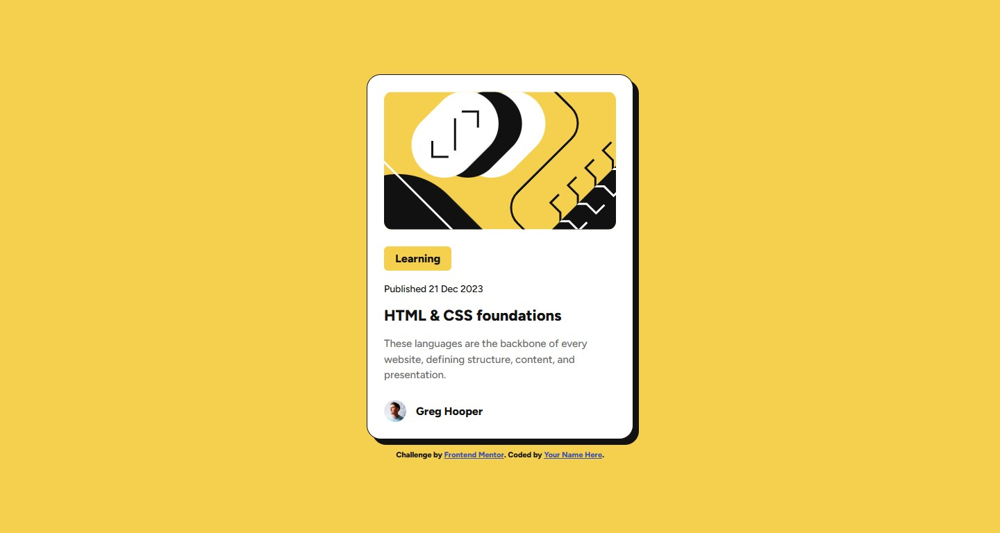

# Frontend Mentor - Blog preview card solution

This is a solution to the Blog preview card challenge on Frontend Mentor. The goal of this challenge was to build a responsive blog card component as close as possible to the original design.

## Overview

### The challenge

Users should be able to:

- See hover and focus states for all interactive elements on the page

### Screenshot



### Links

- Solution URL: https://github.com/mnyellison/blog-preview-card
- Live Site URL:

---

## My process

### Built with

- Semantic HTML5
- CSS custom properties
- Flexbox
- Mobile-first workflow
- Responsive design

---

### What I learned

During this project, I practiced:

- Creating responsive layouts using a mobile-first approach
- Organizing CSS with custom properties
- Improving semantic HTML using tags like `<article>` and `<time>`
- Working with hover and focus states
- Creating reusable spacing and typography variables

Example of CSS variables used in the project:

```css
:root {
  --yellow: #f4d04e;
  --white: #ffffff;
  --gray-500: #6b6b6b;
  --gray-950: #121212;

  --font-family: "Figtree", sans-serif;
}
```

---

### Continued development

In future projects, I want to continue improving:

- Responsive layouts
- Accessibility practices
- CSS organization
- Semantic HTML
- Component-based structure

---

### Useful resources

- Frontend Mentor
- MDN Web Docs
- CSS Tricks

---

### AI Collaboration

I used ChatGPT during this project to:

- Better understand semantic HTML tags
- Improve accessibility
- Refine CSS organization
- Fix responsive layout issues
- Learn best practices for mobile-first development

The AI helped me understand concepts instead of only giving ready-made solutions.

---

## Author

- Frontend Mentor - https://www.frontendmentor.io/profile/mnyellison
- GitHub - https://github.com/mnyellison
